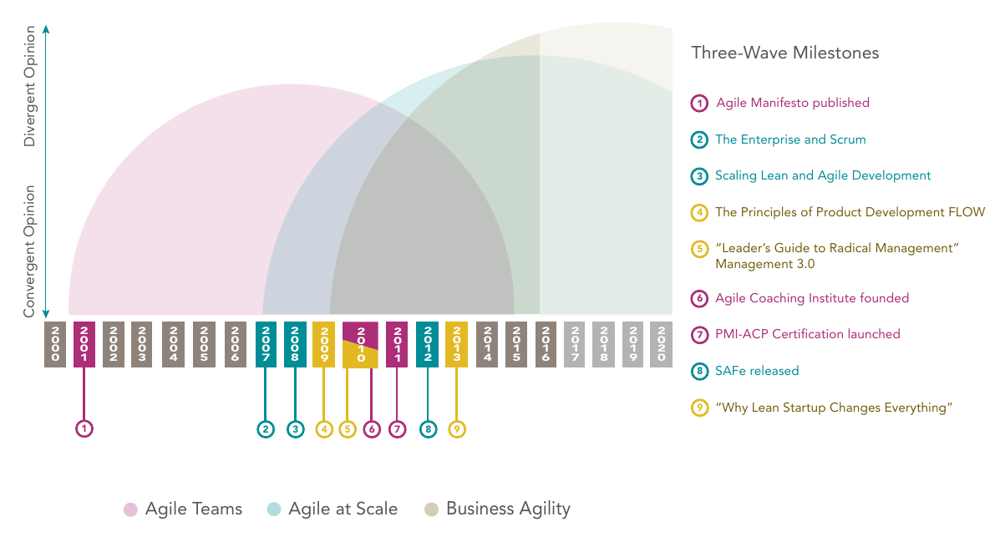
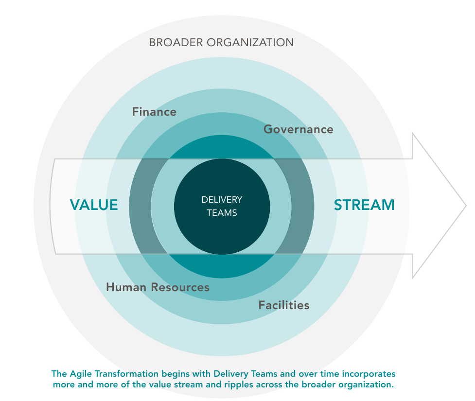

# TDE - Business Agility

Aluno: Marcio Vinicius de Souza da Rocha

---

Primeiramente é necessário entender qual a diferença de ágil e de agilidade (Agile VS Agility). Ambos os termos são altamente utilizados atualmente.

## Ágil

Ágil é uma mentalidade de pensamento com foco em colaboração, entregas de valores frequentes e a habilidade de lidar com alterações de requisitos funcionais.

Esta mentalidade de pensamento é formada por uma série de valores, princípios, métodos e práticas.

Normalmente Métodos Ágeis são focados para pequenas equipes. Para grandes equipes se faz o uso de Ágil Escalado em que essas grandes equipes extendem o processo ágil e estrutura interna para diversas equipes menores.

Ágil foi inventado pela indústria de software, mas atualmente diversas empresas e setores industriais fazem o uso desses valores, princípios, métodos e práticas.

## Agilidade

Agilidade é a capacidade de uma empresa responder e se adaptar às mudanças, tanto mudanças externas quanto as mudanças internas.

Esta capacidade tornou-se um fator determinante, e existem diversas maneiras de se alcançar a agilidade, dentre estas estão as tecnologias digitais, inovação de planejamento do produto, troca de cultura, dentre outras.

## Junção de Ágil e Agilidade

Vimos que Ágil e Agilidade possuem objetivos diferentes, em que ágil tem como objetivo performance e agilidade tem como objetivo tornar a empresa/companhia mais responsiva às mudanças. Porém esta agilidade alcançada pelas empresas necessitam de elementos ágeis.

O contexto de transformações digitais é um exemplo de que são necessários ambos os conceitos de Ágil e Agilidade, em que ambos os conceitos proveram que grandes empresas passassem pela transformação digital.

## O que é *Business Agility*

O termo *Business Agility* foi dotado pela primeira vez em 2016 no artigo *"The third wave of agile"*[1], que define a história das metodologias ágeis em 3 etapas denomidadas de ondas, e este termo se refere à *Terceira Onda*.

Neste artigo é definido também o ciclo de vida de uma *onda*, em que esta tem início quando pessoas começam a se organizar em torno de práticas inovadoras para resolverem problemas, e conforme vai ganhando magnitude comunidades distintas começam a emergir.

Essas novas comunidades começam a fazer questionamentos gerando opniões divergentes. Após as comunidades assimilarem as diferenças estas opniões começam a convergir.

Quando se possui um processo estável e um consenso de como utilizar esta abordagem de maneira consistente atingindo bons resutlados é determinado o fim desta *onda*

1. Ágil para times *(Agile Teams)*
2. Ágil escalado *(Agile at Scale)*
3. Agilidade para negócios *(Business Agility)*

*Imagem retirada do artigo[1].*

### A Primeira Onda - *(Agile Teams)*

De acordo com este artigo[1] a *primeira onda* tem como principal meta estabelecer uma equipe ágil menor para produzir softwares de melhores qualidades. O início desta *primeira onda* se dá com a publicação do *Manifesto Ágil*[2] e o fim desta onda é marcado por dois acontecimentos.

* A fundação do *Agile Coaching Institute (ACI)*[4] em 2010, aceitando o fato de que a maneira mais efetiva de desenvolver times ágeis é por treinamento.
* A introdução da *PMI ACP Agile certification*[5] em 2012.

### A Segunda Onda - *(Agile at Scale)*

A diferente da *primeira onda* a *segunda onda* possui como objetivo integrar e coordenar o trabalho através de equipes ágeis. Esta teve como marco inicial, logo antes do final da *primera onda*, a publicação do livro *The Enterprise and Scrum*[6].

Com a segunda onda emergiu uma nova disciplina *Gerenciamento de Mudanças Organizacionais Ágil*, *Agile Organizational Change Management (OCM)*, que este tem como principios a encapsulação dos conceitos principais do Ágil para o gerenciamento de mudanças. O fim desta *segunda onda* será marcado pelo estabelicimento de um consenso a respeito da prátiica de *Agile OCM*.

*Imagem retirada do artigo[1].*

### A Terceira Onda - *(Business Agility)*

A *terceira onda* começa, logo após o início da *segunda onda*, em 2010 com os conceitos de *Management 3.0* e a publicação do livro *The Lean Startup*[7] junto da utilização de métodos ágeis em todas as equipes/áreas da empresa. Ou seja, a *terceira onda* tem como foco a aplicação de conceitos ágeis aplicado de uma maneira generalizada na empresa fazendo com que as empresas fiquem mais centradas nos clientes, o que irá auxiliar estas empresas a se adaptarem de maneira rápida às mudanças de mercado ou internas.  

Dessa maneira permite que as empresas realizem inovações de maneira mais econômica, sem comprometar a qualidade do produto ou de atendimetno ao cliente. Para que isso seja possível a estrutura da empresa deve se basear nos principios das duas ondas anteriores.

#### Princípios

1. Mudança de cultura consistente - Foco em resultados
2. Engajamnento do funcionário - O engajamento dos funcionários é uma das principais peças do processo ágil
3. Colaboração orientada pra resultados - A colaboração entre as diferentes áreas da empresa deve ser estimulada para que os resultados sejam obtidos com mais facilidade.
4. Velodicade com eficiência - Não basta realizar uma atividade de maneira rápida, é necessário eficiência. Isto se atinge projetando fluxos de trabalhos mais inteligentes e automatizando tarefas repetitivas.
5. Gerenciamento ágil de recursos - Tomadas de decisões baseadas em dados mais atualizados..
6. Visibilidade - É necessário que os gestores tenham a visibilidade do escopo micro e do macro, com isso conseguem melhor gerencias os objetivos da empresa e os desempenhos das diferentes áreas.

## Bibliografia

1. Rudd, C. (n.d.). ***The Third Wave of Agile.***
2. ***The Agile Manifesto*** "https://agilemanifesto.org"
3. "https://agilexl.com/blog/agile-vs-agility-what-are-the-difference" - acessado em 25/03/2023
4. "https://www.accenture.com/us-en/services/software-engineering/agile-transformation"  - acessado em 25/03/2023
5. "https://www.pmi.org/certifications/agile-acp"  - acessado em 25/03/2023
6. Schwaber, K. (2007). ***The Enterprise and Scrum***
7. Ries, E. (2011). ***THE LEAN STARTUP***
